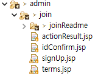

html

<style>
  .tocA{
    color: white;
  }
</style>

# Admin 회원가입

## 목차

* <a href="#toc1" class="tocA">회원가입 기능  구현 영상</a>
* <a href="#toc2" class="tocA">관리자 등록 jsp 소개</a>
* <a href="#toc3" class="tocA">관리자 등록 시 약관 동의 modal 설명</a>

## <dev id="toc1">1. 회원가입 기능 구현 영상</dev>

 🖼️ 회원가입 jsp <br/>

## <dev id="toc2">2. 관리자 등록 jsp</dev>
 🖼️ 관리자 등록 jsp <br/>

    🟥 actionResutlt.jsp - 요청 실행 결과를 받아 다음 요청이나 페이지로의 이동을 처리하는 페이지<br/>
    🟧 idConfirm.jsp - 아이디 중복확인 결과를 보여주는 페이지<br/>
    🟩 signUp.jsp - 회원가입 페이지<br/>
    🟦 terms.jsp - modal 약관을 모아둔 페이지<br/>
___

## <dev id="toc3">3. 관리자 등록 시 약관 동의 modal 부트스트랩 설명</dev>
<video src="./termsEx.mp4" height="350" controls> 🖼️ 약관동의 화면 <br/>

🟥 actionResutlt.jsp

1) 약관 a 태그에 부트트랩 속성 추가 <br/>

```jsp
<tr id="termsTr">
     <th id="termsTh" class="font15"> ✓ 본인인증 약관동의</th>
</tr>
<tr>
     <td><input type="checkbox" id="allCheck" name="allChk" class="chkList" value="a" onclick="chkListClick($('#allCheck'))"><b class="font15">전체동의 합니다.</b></td>
</tr>

<tr >
     <td><input type="checkbox" class="chkList" id="chkList1" name="chkList1" value="1" onclick="chkListClick($('#chkList1'))" required><b class="font15"><span class="check">[필수]</span>
          <a href="#" data-bs-toggle="modal" data-bs-target="#exampleModal1">본인 확인 서비스 이용 약관</a>에 동의합니다.</b></td>
</tr>
<tr>
     <td><input type="checkbox" class="chkList" id="chkList2" name="chkList2" value="2" onclick="chkListClick($('#chkList2'))" required><b class="font15" ><span class="check">[필수]</span>
               <a href="#" data-bs-toggle="modal" data-bs-target="#exampleModal2">통신사 이용 약관</a>동의</b></td>
</tr>
<tr>
     <td><input type="checkbox" class="chkList" id="chkList3" name="chkList3" value="3"><b class="font15"><span class="choose">[선택]</span> 통신사/인증사의 
               <a href="#" data-bs-toggle="modal" data-bs-target="#exampleModal3">개인정보 이용 · 제공</a>에 동의합<br> <span id="left-10px">니다.</span></b></td>
</tr>
<tr>
     <td><input type="checkbox" class="chkList" id="chkList4" name="chkList4"  value="4"><b class="font15"><span class="choose">[선택]</span> <a href="#" data-bs-toggle="modal" data-bs-target="#exampleModal4">고유식별 정보 처리</a>에 동의합니다.</b></td>
</tr>
 ```

* `data-bs-toggle="modal"` => UI 요소 모달을 제어하기 위한 속성
* `data-bs-target="#exampleModal"` => 모달 ID 정의

2) 모달 페이지 (🟦 terms.jsp) 불러오기 
```jsp
<%@ include file="./terms.jsp"%>
```
<br/>
🟦 terms.jsp <br/><br/>

3) 모달 페이지 > 모달 속성  
```jsp
<div class="modal fade" id="exampleModal1" tabindex="-1" aria-labelledby="exampleModalLabel" aria-hidden="true">
  <div class="modal-dialog">
    <div class="modal-content">
      <div class="modal-header">
        <h1 class="modal-title fs-5" id="exampleModalLabel">타이틀</h1>
        <button type="button" class="btn-close" data-bs-dismiss="modal" aria-label="Close"></button>
      </div>
      <div class="modal-body">
          본문
      </div>
      <div class="modal-footer">
        <button type="button" class="btn btn-secondary" data-bs-dismiss="modal">취소</button>
        <button type="button" class="btn btn-primary" data-bs-dismiss="modal" onclick="terms_chk(1)">확인</button>
      </div>
    </div>
  </div>
</div>
```
* `<div class="modal fade" id="exampleModal" ...>` => target과 ID 일치
* `<h1 class="modal-title fs-5" id="exampleModalLabel">` => title 클래스의 h1 태그에서 타이틀 작성
* `<div class="modal-body">` => body 클래스의 div 태그에서 본문 작성
* `<button type="button" class="btn btn-secondary" data-bs-dismiss="modal">취소</button>` 

  => 모달을 닫는 버튼을 footer에서 작성
  
  [ data-bs-dismiss="modal" ] : 요소가 클릭될 때 모달을 닫는 속성
* `<button type="button" class="btn btn-primary" data-bs-dismiss="modal" onclick="terms_chk(1)".>동의하기</button>`

   => 모달을 닫으면서 click 시 js 함수를 호출하여 동작을 실행하는 버튼을 footer에서 작성

___